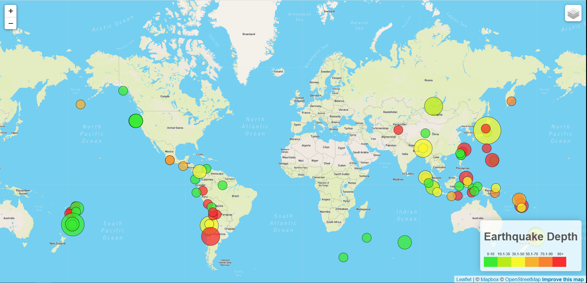
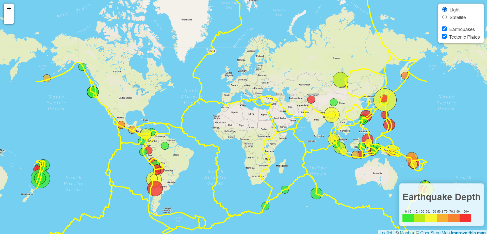
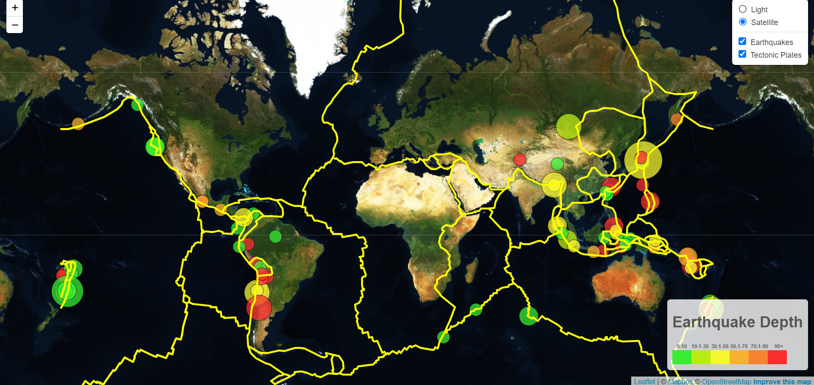

# Mapping Earthquake Locations and Tectonic Plates

## Overview

### Step 1

A map illustrating locations of 4.5+ magnitude earthquakes over a recent week was created. Data was pulled from the USGS site, found [here](https://earthquake.usgs.gov/earthquakes/feed/v1.0/summary/4.5_week.geojson). Using leaflet.js, the locations were depicted by circle markers. The color of the circle depended on the depth of the earthquake, ranging from green (shallow) to red (deep), and the radius, or size of the circle depended on the magnitude. A legend was also created to visualize the color ranges for depth. These circles were turned into a map layer, and along with the light map tile layer used from mapbox.com, a map was generated.

### Step 2

Continuing with the code from step 1, a new data set that included coordinates for tectonic plate boundaries, found [here](https://raw.githubusercontent.com/fraxen/tectonicplates/master/GeoJSON/PB2002_boundaries.json), was read in. Using L.geoJSON, it was converted to a layer that outlined the boundaries, and was added to the map. Along with this, another tile layer from mapbox.com was added, the satellite layer. With these new layers added, users can toggle between the base layers (tile layers) as well as the overlay layers (marker layers) to their appropriate viewing likings.

## Data

Data was pulled from the USGS site at https://earthquake.usgs.gov/earthquakes/feed/v1.0/summary/4.5_week.geojson in geoJSON format.

## Tools and Languages

* JavaScript, Leaflet.js
* HTML/CSS
